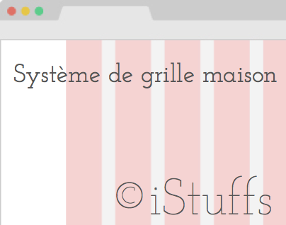
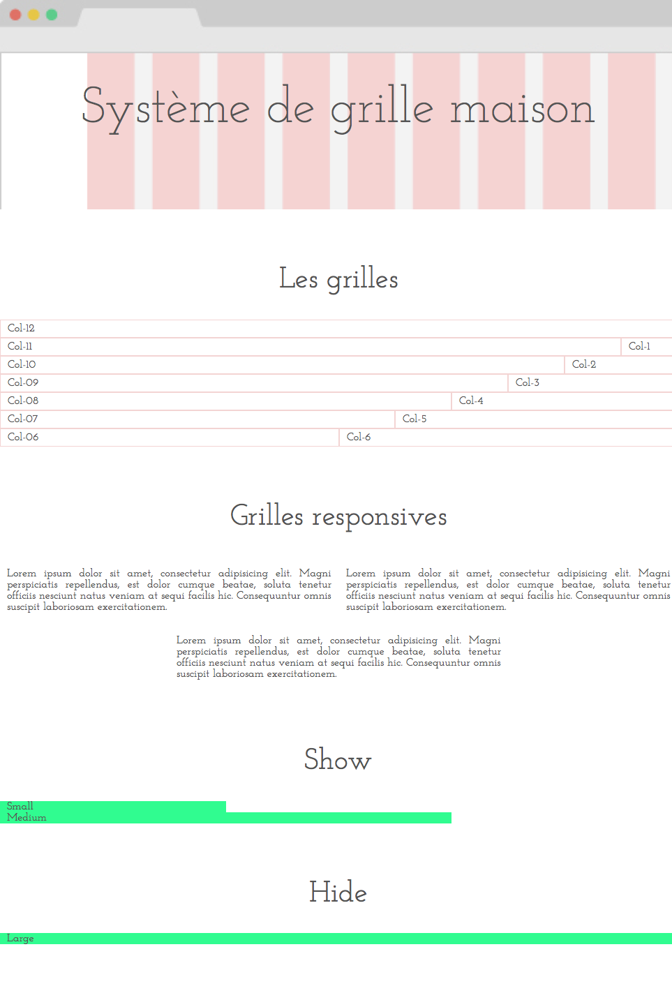
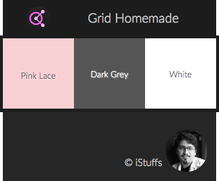

# Système de grille maison

Je souhaitais aller plus loin dans la compréhension des systèmes de grille responsive. J'ai donc décidé de recréer un système similaire à celui du twitter bootsrap ([http://getbootstrap.com](http://getbootstrap.com)) pour comprendre les mécanismes, les difficultés techniques et compromis derrière ces outils de grille.

## Thème

- **Pink Lace**: #F8D0D3
- **Dark Grey**: #555
- **White**: #FFF

## Police de caractère

**Josefin Slab** | [https://www.google.com/fonts/specimen/Josefin+Slab](https://www.google.com/fonts/specimen/Josefin+Slab)
Je souhaitais une police qui allie la grâce et la sophistication d'une police serif avec la simplicité et la modernité habituelles du web Design. J'ai retrouvé toutes ces qualités avec **Josefin Slab**.

## En savoir plus

**Behance**: [https://www.behance.net/gallery/28530099/Grid-Homemade](https://www.behance.net/gallery/28530099/Grid-Homemade)
**Live demo**: [http://istuffs.github.io/grid-homemade/](http://istuffs.github.io/grid-homemade/)

---
©iStuffs